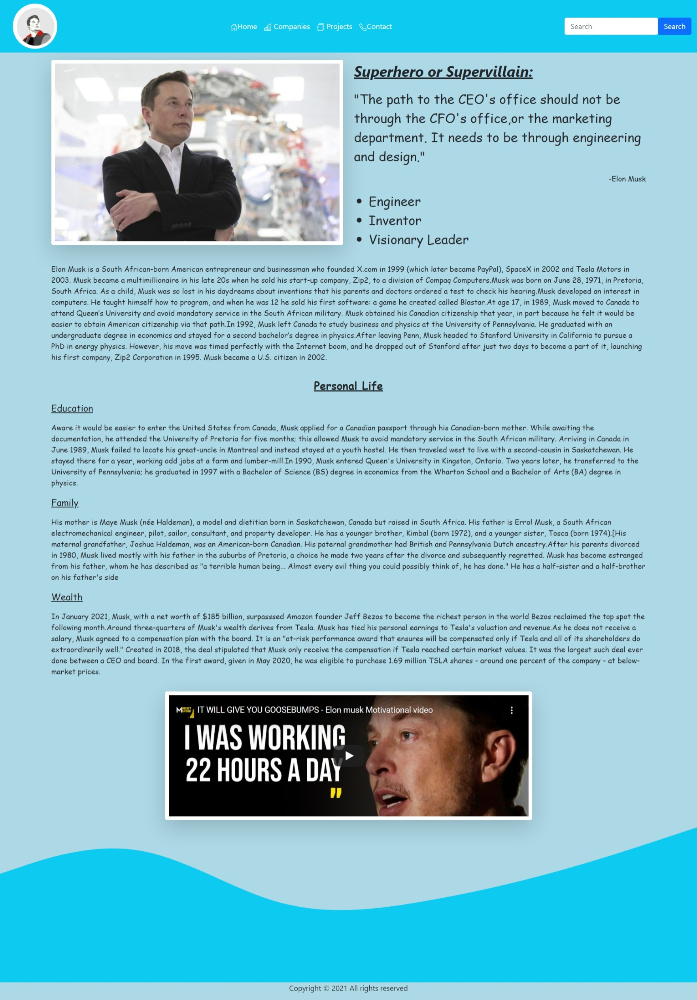
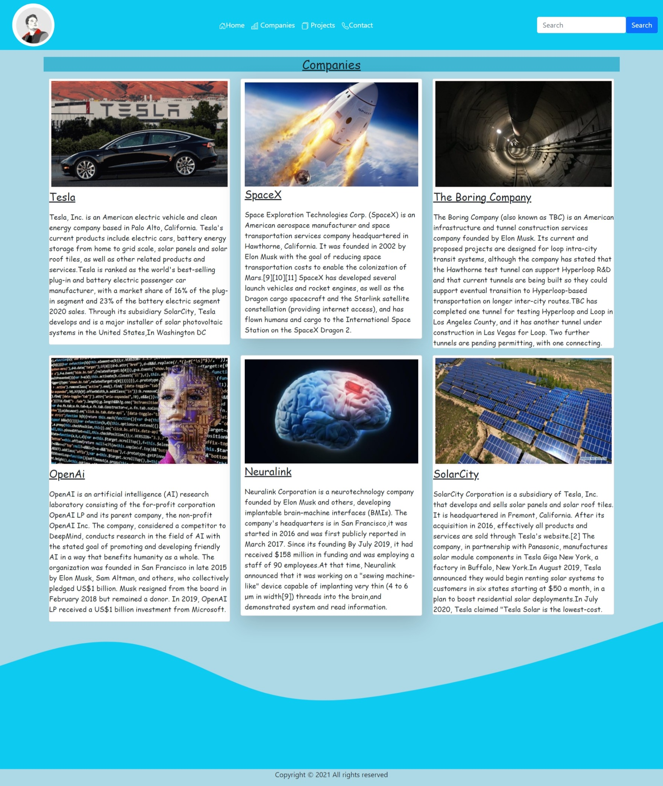
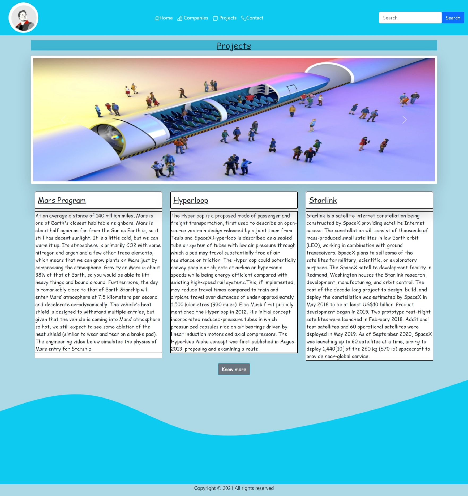
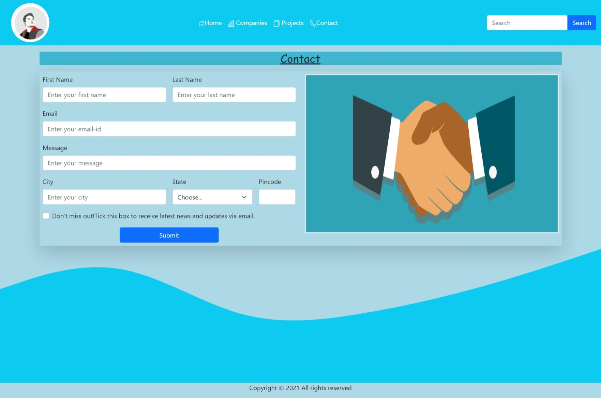

# static-website
This website is based on Elon Musk.
<h4>How to run:</h4>

Create a folder with a suitable name at your desired location.

Copy all the above existing folders and files and paste it into your created folder.

Open the created folder in Visual Studio Code.

Run home.html file.

<h4>Screenshots:</h4>

  <h4>Home.html</h4>

   <h4>Companies.html</h4>

   <h4>Projects.html</h4>

  <h4>Contact.html</h4>

 

